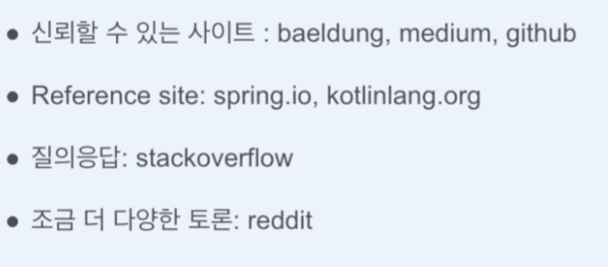
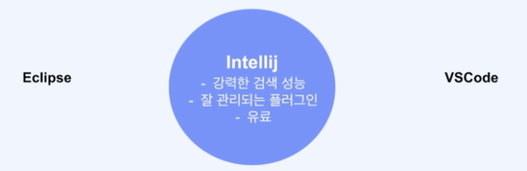
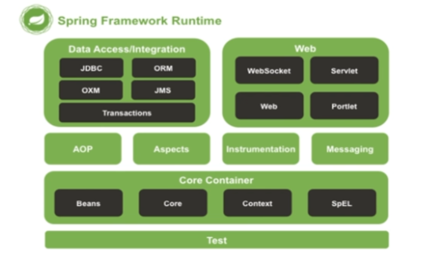
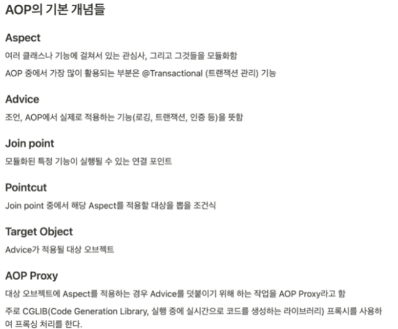
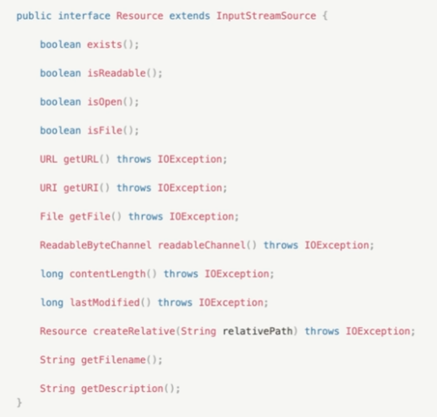
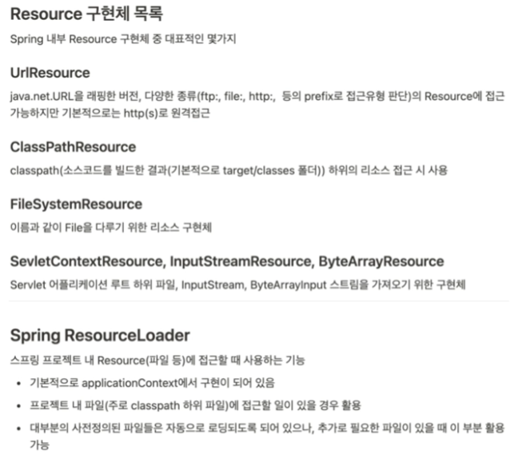
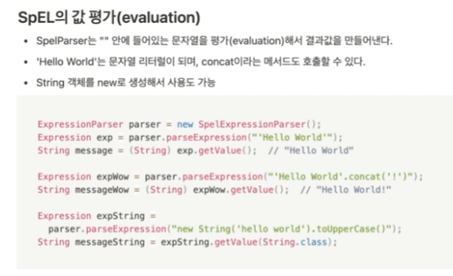
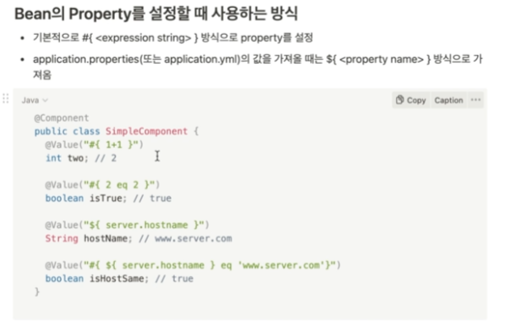

> 인텔리제이 - 단축키, 리팩토링, 디버깅  
> 파트1 : 스프링프레임워크 

[Core Container] 
- Core(DI,IoC[컨테이너에서 Beans을 생성 관리]) ,Beans[데이터저장하기위한 구조체로서 각각의 Bean들 끼리는 
서로를 편리하게 의존해서 사용가능] )  , Context(SpringApplicationContext- Bean객체의 생성 및 조립 담당), SpEL 

[Beans을 생성하는 규칙] 
- singleton(단일)
- prototype(작업시마다 새로생성)
- request(http요청마다 새로 생성) 
@PostConstruct(초기화-빈생성시점에 필요한 작업), @PreDestroy(소멸시점에 필요한 작업)  

- [관점지향프로그래밍]
- AOP(로깅,트랜잭션,인증 등 OOP로 처리하기 까다로운 부분을 AOP로 처리)

- Validation(인터페이스), DataBinding(Converter : request(s->t), Formatter :request,response ) 

- Resources: 경로를 넘어서서 자원 가져오기  
 

 
- SpEL

- Null-safety : @NotNull 어노테이션 활용 , @Nullable 은 null이 들어올수있는 경우에 사용하여 주의하며 코딩

> 파트2 : 스프링부트 
> 
> 파트3 : 스프링 web mvc 
> 
> 파트4 : 스프링 데이터 jpa 
> 
> 파트5 : 스프링 시큐리티 
> 
> 파트6 : 스프링 OAuth2 Socil 
> 
> 파트7 : 스프링 배치 
> 
> 파트8 : 스프링 REST Docs 
> 
> 파트9 : 실무밀착프로젝트 - 코로나 줄서기 서비스 
> 
> 파트10 :파이널프로젝트 -캘린더스케줄 도메인, 알림배치, 캘린더 공유  
> 
 

협업하고 싶은 백엔드 개발자 되기
